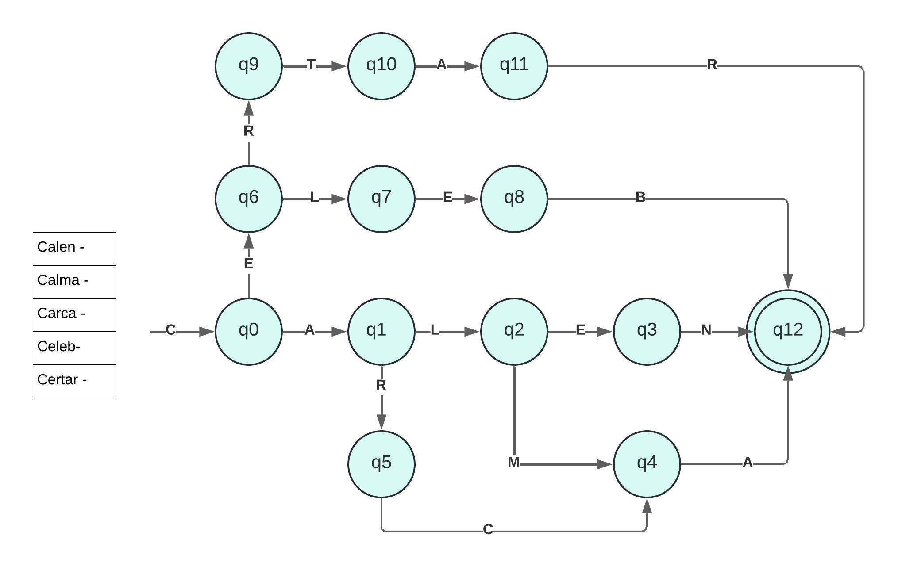

# Automaton-Regular-Expression

## Description
The language I chose was elven

The words inlcuded in my lexical analysis are the following:
Calen - Sindarin word for 'green', Calma - Quenya word for 'Lamp', Carca - Quenya word for 'fang' , Celeb- Quenya word for 'silver', Certar - Quenya word for 'Runes', referring in particular to the "Alphabet of Daeron". 

The **modeling technique** I decided to use was a Non-deterministic Finite Automata  (NFA) to represent my solutions since they are easier to model and are often used in the literature to model lexeme parsers as mentioned in (Dom et al 2033). 

## Model of the Solution

I modeled my automaton to cover the 5 words from the elvish language provided

 

The presented automaton is equivalent to the following regular expression:

NDA 1 -> RE 1:
{[1,2,3]*}

## Implementation

For my implementation of a lexical analysis, I followed the regular expressions as can be seen in the regex.py file.
To use the file you need to put the input in the format of a string “1222344”  and the program should return yes if the string is accepted or no if the string is not part of the language.

some examples of inputs and outputs are: 
 
  1123125  -> no

  112312  -> yes

  11  -> yes

  1222123125  -> no

## Tests

The file tests.py contains all the cases tested for regular expressions. 

## Analysis

The **complexity** of my model is in general n, where n  is the length of the string to be processed. Here is my proof by induction or hand analysis time complexity:

     for i < n
       if i in n
        i ++
       end
….  

I used the regex library from Python which internally according to the API documentation uses the algorithms from Unix to better parse... etc ... this means that my time complexity in general remains as O(n) 

My first approach to the **solution** was to use an automaton in prolog which is also a natural solution however following the recommendations I found in  (sun et al, 2054)  I preferred the Regular Expression because it is faster in the context of ... etc ... havinf an overall time of  O(log n)

## References

- Dom, Dim, and Dum (2033) "The magic of showing projects in GitHub so the student will feel less anxious about what they have to hand in as evidence", BENs Happy Books, 3rd edition, page 42.
- Sun, Son, Sen, San, and Pepe (2054), "Git Gud at computer theory" available at www.gitgud.com/computers-tutorials_NFA_DFA_RE.
